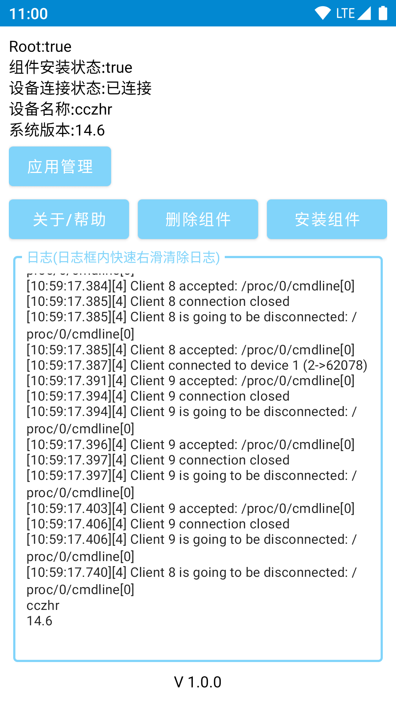
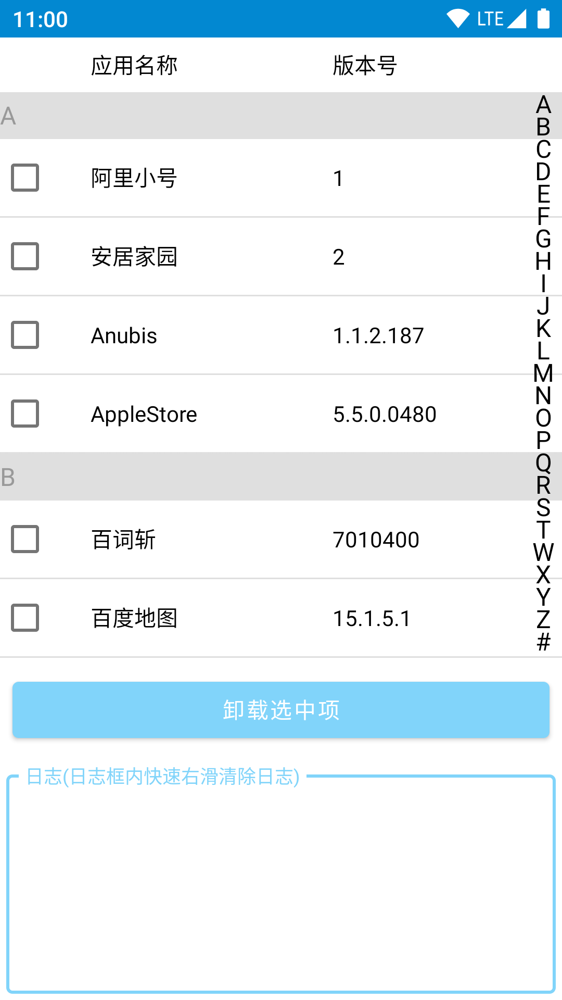

# OTGUninstallApps

本项目基于[libimobiledevice](https://github.com/libimobiledevice)开源项目开发，实现了Android设备OTG连接iPhone后，批量卸载iPhone已安装的应用的功能。

   
   

大佬请我喝快乐水专用码╭(●`∀´●)╯

   

# License

This library and utilities are licensed under the [GNU General Public License v3.0](https://www.gnu.org/licenses/gpl-3.0.en.html), also included in the repository in the `COPYING.GPLv3` file.